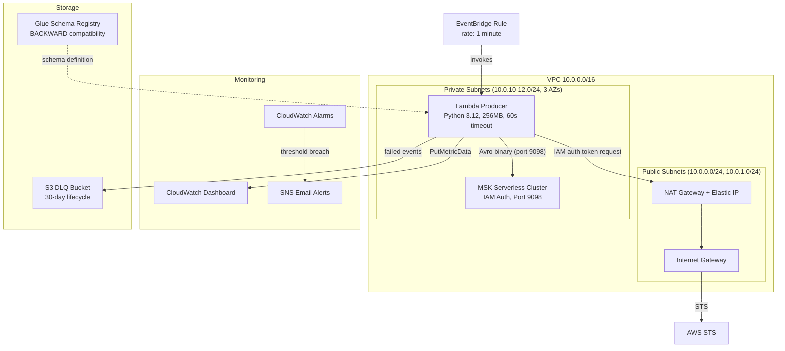

# ShopStream Real-Time Streaming Platform

Event-driven data ingestion platform for ShopStream e-commerce. Captures clickstream events at 100K events/hour with exactly-once guarantees, schema enforcement, and production monitoring.

## Architecture



## How It Works

### Scheduled Trigger (EventBridge)

The producer runs automatically on a 1-minute schedule via EventBridge:

```
EventBridge Rule (rate: 1 minute)
    │
    ├── Fires every 60 seconds (clock-based, not event-driven)
    ├── Target: Lambda function ARN
    ├── Permission: aws_lambda_permission allows events.amazonaws.com to invoke
    │
    ▼
Lambda invoked (identical to manual `aws lambda invoke`)
```

**Operational control:**
```bash
# Pause producing (keeps rule, stops invocations)
aws events disable-rule --name shopstream-dev-producer-schedule --region us-east-1

# Resume
aws events enable-rule --name shopstream-dev-producer-schedule --region us-east-1
```

### Event Flow

```
EventBridge (every minute)
    │
    ▼
Lambda Cold Start
    ├── boto3.get_bootstrap_brokers() → NAT → STS → broker endpoint
    ├── Load Avro schema from bundled .avsc file
    └── Cache for subsequent warm invocations
    │
    ▼
Lambda Handler (each invocation)
    ├── ensure_topic_exists() → creates topic if first run (idempotent)
    ├── Generate 1500-2000 realistic clickstream events
    ├── For each event:
    │   ├── Validate + serialize to Avro binary (~100 bytes vs ~250 bytes JSON)
    │   ├── produce(key=session_id, value=avro_bytes) → internal buffer
    │   └── poll(0) → serve any ready delivery callbacks
    ├── flush(30s) → send all buffered batches, wait for all acks
    ├── Publish partition distribution to CloudWatch
    ├── Write any failures to S3 DLQ
    └── Return: {delivered: 1743, errors: 0, partition_distribution: {...}}
```

### Internal Batching (confluent-kafka)

The producer does NOT send one network request per event. `produce()` appends to internal per-partition buffers. A background thread sends batches when:

- Buffer for a partition reaches `batch.size` (64KB), OR
- Time since first buffered message exceeds `linger.ms` (20ms)

With 2000 events of ~100 bytes across 12 partitions, each partition gets ~17KB — below the 64KB threshold. So `linger.ms` triggers all sends after 20ms. Result: **~12 network requests** instead of 2000.

### IAM Authentication Flow

MSK Serverless only supports IAM auth. The flow:

```
1. confluent-kafka needs to connect to broker
2. Internally calls oauth_cb() callback
3. oauth_cb() → MSKAuthTokenProvider.generate_auth_token("us-east-1")
4. MSKAuthTokenProvider → Lambda ENI → NAT Gateway → Internet → AWS STS
5. STS returns signed token (proves Lambda has kafka-cluster:Connect permission)
6. confluent-kafka sends token in SASL handshake to MSK on port 9098
7. MSK validates token against IAM policy → connection established
```

Critical: `producer.poll(10.0)` must be called after creating the producer — this triggers the `oauth_cb`. In confluent-kafka < 2.13, the callback only fires via the event queue, not automatically.

### Partition Strategy

Key = `session_id` (12 chars of UUID). Deterministic assignment:

```
hash(session_id) % 12 → partition number
```

This guarantees: all events in one user session land on the same partition → ordering preserved per session. Critical for downstream funnel analysis (page_view → add_to_cart → purchase must be in order).

UUID-based session IDs distribute evenly across partitions. Monitored via CloudWatch custom metrics — if any partition receives >2x the average, the key distribution is skewed.

### Dead-Letter Queue

When a message permanently fails delivery (all retries exhausted, message too large, or topic deleted):

```
delivery_callback(err=KafkaError, msg=message)
    │
    ├── Capture: error string, topic, key, value_size
    ├── Append to in-memory dlq_buffer
    │
    ... (after flush completes) ...
    │
    └── flush_dlq_to_s3()
        └── Write single JSON file to:
            s3://shopstream-raw-{account}/dlq/clickstream/year=YYYY/month=MM/day=DD/hour=HH/{timestamp}_{uuid}.json
```

The S3 path uses Hive-style partitioning for Athena queryability. Files auto-expire after 30 days via lifecycle rule.

## Networking

### Why Private Subnets for MSK + Lambda?

MSK brokers have no public endpoint. They're only reachable from within the VPC. Lambda must be placed inside the VPC (same private subnets) to reach MSK on port 9098.

### Why NAT Gateway?

Lambda in private subnets has no internet access. But it needs to reach:
1. **AWS STS** — to generate IAM auth tokens for MSK
2. **AWS Kafka API** — to call `GetBootstrapBrokers` (resolves broker endpoints)
3. **CloudWatch API** — to publish custom partition metrics

NAT Gateway provides one-way internet: outbound only (Lambda can call out, but nothing from internet can call in).

### Security Group

Single security group shared by MSK and Lambda:

| Rule | Direction | Port | Source | Purpose |
|------|-----------|------|--------|---------|
| Ingress | Inbound | 9098 | VPC CIDR (10.0.0.0/16) | Kafka protocol |
| Ingress | Inbound | All | Self (same SG) | MSK ENIs communicate with each other |
| Egress | Outbound | All | 0.0.0.0/0 | Lambda → NAT → Internet |

The self-referencing rule is required for MSK Serverless — its ENIs need to talk to each other within the security group.

## Schema Enforcement

### Avro Schema: `ClickstreamEvent`

```json
{
  "type": "record",
  "name": "ClickstreamEvent",
  "namespace": "com.shopstream.events",
  "fields": [
    {"name": "event_id",    "type": "string",                    "doc": "UUID, unique per event"},
    {"name": "session_id",  "type": "string",                    "doc": "Kafka partition key"},
    {"name": "user_id",     "type": ["null", "string"],          "doc": "Null for anonymous (15%)"},
    {"name": "event_type",  "type": {"type": "enum", "symbols": ["PAGE_VIEW", "SEARCH", "ADD_TO_CART", "PURCHASE"]}},
    {"name": "product_id",  "type": ["null", "string"],          "doc": "Null for search events"},
    {"name": "category",    "type": "string",                    "doc": "Product category"},
    {"name": "timestamp",   "type": "long",                      "doc": "Epoch milliseconds UTC"},
    {"name": "page_url",    "type": "string",                    "doc": "Page where event occurred"},
    {"name": "referrer",    "type": "string",                    "doc": "Traffic source"},
    {"name": "device_type", "type": "string",                    "doc": "desktop/mobile/tablet"},
    {"name": "properties",  "type": {"type": "map", "values": "string"}, "doc": "Flexible KV pairs"}
  ]
}
```

### Why Avro Over JSON?

| Aspect | JSON | Avro |
|--------|------|------|
| Size per event | ~250 bytes | ~100 bytes |
| Field names in message | Yes (repeated every message) | No (schema defines order) |
| Type validation | None (string "123" vs int 123) | Strict (wrong type → rejected) |
| Enum enforcement | None | Invalid value rejected at producer |
| Schema evolution | Hope and pray | Registry enforces compatibility rules |

### BACKWARD Compatibility

Registered in Glue Schema Registry with BACKWARD mode. This means:

**Allowed schema changes:**
- Add a new field WITH a default value (old messages readable — default fills in)
- Remove a field that HAS a default value

**Rejected schema changes:**
- Add a required field (no default) — old messages don't have it
- Change a field's type — old messages have wrong type
- Remove an enum symbol — old messages reference it

This protects downstream consumers: they can always read messages produced with older schema versions.

## Producer Configuration

| Setting | Value | Why |
|---------|-------|-----|
| `acks` | `all` | Wait for ALL in-sync replicas to acknowledge. Message survives any single broker failure |
| `enable.idempotence` | `true` | Broker assigns sequence number per producer+partition. Retried messages deduplicated automatically — no duplicates even on network failures |
| `max.in.flight.requests.per.connection` | `5` | Maximum allowed with idempotence enabled (Kafka protocol requirement) |
| `retries` | `2147483647` | Effectively infinite. Combined with idempotence, retries are safe (no duplicates) |
| `compression.type` | `snappy` | ~60% size reduction on Avro payloads. Fast compression (~250MB/s) and decompression. Good for structured data |
| `linger.ms` | `20` | Wait up to 20ms to fill a batch before sending. Trades 20ms latency for better throughput (more messages per network request) |
| `batch.size` | `65536` | 64KB max batch size per partition. Larger batches = better compression ratio + fewer requests |
| `broker.address.family` | `v4` | Force IPv4 DNS resolution. Avoids IPv6 issues in Lambda VPC |

## Topic Design

| Property | Value | Rationale |
|----------|-------|-----------|
| Name | `shopstream.clickstream` | Dot-separated convention: namespace.entity |
| Partitions | 12 | Target: 100K events/hr. At ~10K events/partition/hr throughput ceiling = 10 partitions. Rounded to 12 for growth headroom |
| Partition Key | `session_id` | All events in a user session ordered together — required for funnel analysis |
| Retention | 7 days | Replay window: if consumer crashes, it can reprocess up to 7 days of history |
| Replication Factor | 3 | Each message on 3 brokers. Any 1 broker can die without data loss |
| Cleanup Policy | `delete` | Time-based deletion after retention expires. (Alternative: `compact` keeps latest per key — not needed for event streams) |

## Event Generator

Models realistic e-commerce user behavior:

| Characteristic | Distribution | Rationale |
|---------------|-------------|-----------|
| Event types | 70% page_view, 15% search, 10% add_to_cart, 5% purchase | Real e-commerce conversion rate: 2-5% |
| Device | 50% mobile, 40% desktop, 10% tablet | Mobile-first in 2024+ |
| Anonymous users | 15% null user_id | Not all visitors are logged in |
| Traffic source | Google (weighted), direct, Facebook, email, social | Reflects real referrer distribution |
| Batch size | 1500-2000 per minute | Random variation simulates real traffic variability |
| Timestamp | Jittered within 60s window | Events don't all happen at exactly the same millisecond |

## Monitoring

### CloudWatch Dashboard

Four panels providing operational visibility:

| Panel | Metrics | What to look for |
|-------|---------|-----------------|
| **Invocations & Errors** | Lambda Invocations (blue), Errors (red) per minute | Steady invocations + zero errors = healthy. Errors spike = check logs |
| **Duration** | Average (blue) and Maximum (red) in milliseconds | Normal: 5-10s avg. Max approaching 60s = timeout risk |
| **Messages Per Partition** | 12 lines (P0-P11), one per partition | All lines roughly equal height = balanced. One line 2x others = hot partition |
| **DLQ Object Count** | S3 object count in dlq/ prefix | Should always be 0. Any increase = investigate |

### Alarms

| Alarm | Metric | Threshold | Period | What it means |
|-------|--------|-----------|--------|---------------|
| **DLQ not empty** | S3 NumberOfObjects | > 0 | 60s, 1 eval | Events are failing delivery — immediate investigation |
| **Producer errors** | Lambda Errors | > 0 | 5 min, 1 eval | Function crashing (import error, timeout, OOM) |
| **Producer slow** | Lambda Duration (max) | > 45000ms | 5 min, 2 evals | Approaching 60s timeout — MSK connectivity issue |

All alarms route to SNS → email notification.

### Metric Filters (Log-based Metrics)

CloudWatch scans Lambda logs for JSON output and extracts:
- `EventsDelivered` — value of `$.delivered` from each invocation's result JSON
- `EventErrors` — value of `$.errors` (only when > 0)

These appear in the `ShopStream/Kafka` namespace alongside the custom partition metrics.

## IAM Permissions (Least Privilege)

### Lambda Role Policies

| Policy | Permissions | Scoped to |
|--------|------------|-----------|
| **MSK Access** | `kafka:GetBootstrapBrokers`, `kafka-cluster:Connect`, `WriteData`, `ReadData`, `CreateTopic` | This cluster + its topics/groups only |
| **Lambda Basic** | CloudWatch Logs write | Auto-created log group |
| **Lambda VPC** | Create/delete ENIs | VPC subnets |
| **Glue Schema** | `GetSchema`, `GetSchemaVersion`, `RegisterSchemaVersion` | This registry + schema only |
| **Extras** | `cloudwatch:PutMetricData` (namespaced), `s3:PutObject` (dlq/ prefix only) | Condition on namespace, specific bucket prefix |

No `*` resource permissions except CloudWatch PutMetricData (which is constrained by a namespace condition).

## Project Structure

```
realtime-streaming-platform/
├── terraform/
│   ├── main.tf              # All infrastructure
│   │                        #   - VPC, subnets, NAT, IGW, route tables
│   │                        #   - MSK Serverless cluster
│   │                        #   - Glue Schema Registry + ClickstreamEvent schema
│   │                        #   - IAM roles + policies (MSK, Glue, CloudWatch, S3)
│   │                        #   - Lambda function + layer
│   │                        #   - EventBridge rule (1-minute schedule) + Lambda permission
│   │                        #   - S3 DLQ bucket + lifecycle
│   │                        #   - CloudWatch log group, metric filters
│   │                        #   - SNS topic, alarms, dashboard
│   ├── variables.tf         # aws_region, environment, project_name, alert_email
│   └── outputs.tf           # Cluster ARN, dashboard URL, SNS topic ARN
├── src/producer/
│   ├── handler.py           # Lambda handler: event generation + Kafka producing
│   ├── serializer.py        # Avro serialization with fastavro
│   ├── topic_admin.py       # Idempotent topic creation via AdminClient
│   └── schemas/
│       └── clickstream_event.avsc  # Avro schema definition (11 fields)
├── scripts/
│   ├── build_layer.sh       # Builds Lambda layer (confluent-kafka, fastavro, setuptools)
│   ├── load_test.sh         # Concurrent invocation load test
│   └── create_topic.py      # Standalone topic creation (alternative to auto-create)
├── requirements.txt         # Python dependencies with pinned versions
└── .gitignore               # Credentials, build artifacts, Terraform state
```

## Deploy

### Prerequisites
- AWS account with credentials configured
- Terraform >= 1.5.0
- Python 3.12 + pip

### Steps

```bash
# 1. Build Lambda layer (installs confluent-kafka + fastavro for Lambda runtime)
./scripts/build_layer.sh

# 2. Deploy all infrastructure (~15-20 min first time, MSK cluster creation)
cd terraform
source .env
terraform init
terraform apply -var="alert_email=you@example.com"

# 3. Confirm SNS subscription (check email, click "Confirm subscription")

# 4. Test single invocation (EventBridge will also auto-invoke every minute)
aws lambda invoke --function-name shopstream-dev-clickstream-producer \
    --region us-east-1 /tmp/out.json && cat /tmp/out.json

# Expected output:
# {"batch_size": 1743, "delivered": 1743, "errors": 0, "unflushed": 0,
#  "partition_distribution": {"0": 145, "1": 148, ...}, "dlq_count": 0}

# 5. Load test (100 concurrent invocations)
cd ..
./scripts/load_test.sh us-east-1

# 6. View dashboard
terraform output dashboard_url

# 7. Pause scheduled production (optional — save costs when not testing)
aws events disable-rule --name shopstream-dev-producer-schedule --region us-east-1
```

### Teardown (save costs)

```bash
cd terraform
terraform destroy
```

NAT Gateway costs ~$1.15/day. Destroy when not actively developing.

## Design Decisions

### MSK Serverless over MSK Provisioned
- No broker sizing decisions at dev scale
- Auto-scales to traffic (pay per GB in/out)
- IAM auth only (simpler than SASL/SCRAM certificate management)
- Tradeoff: less config control, no custom broker settings

### Lambda over ECS for Producer
- Invocation-based billing (free when not producing)
- No container to manage
- Natural fit for scheduled event generation (EventBridge → Lambda)
- Tradeoff: 60s timeout limits batch size, cold start adds ~2s latency

### fastavro over aws-glue-schema-registry library
- Pure Python with C extensions — fast serialization
- Simple API: `schemaless_writer(buffer, schema, record)`
- No Glue API call per message (schema bundled locally, validated at serialization time)
- Tradeoff: schema changes require Lambda redeployment (not runtime-fetched)

### Single Security Group for MSK + Lambda
- Simplifies networking: both share same SG, self-referencing rule handles inter-ENI traffic
- Tradeoff: less granular control (can't restrict Lambda-to-Lambda within the SG)

## Cost Estimate

| Resource | $/day | $/month | Notes |
|----------|-------|---------|-------|
| NAT Gateway | $1.15 | $35 | Fixed hourly + $0.045/GB. Destroy when not using |
| MSK Serverless | $0.10 | $3 | Pay per GB at dev volume (~1MB/day) |
| Lambda | $0.01 | $0.30 | 256MB × 10s × few invocations/day |
| S3 | <$0.01 | <$0.01 | DLQ only, negligible storage |
| CloudWatch | <$0.01 | ~$1 | Custom metrics + dashboard |
| EventBridge | Free | Free | Scheduled rules have no per-invocation charge |
| Glue Schema Registry | Free | Free | No per-schema cost |
| **Total (active)** | **~$1.30** | **~$40** | Dominated by NAT Gateway |
| **Total (destroyed)** | **$0** | **$0** | All serverless/on-demand |
